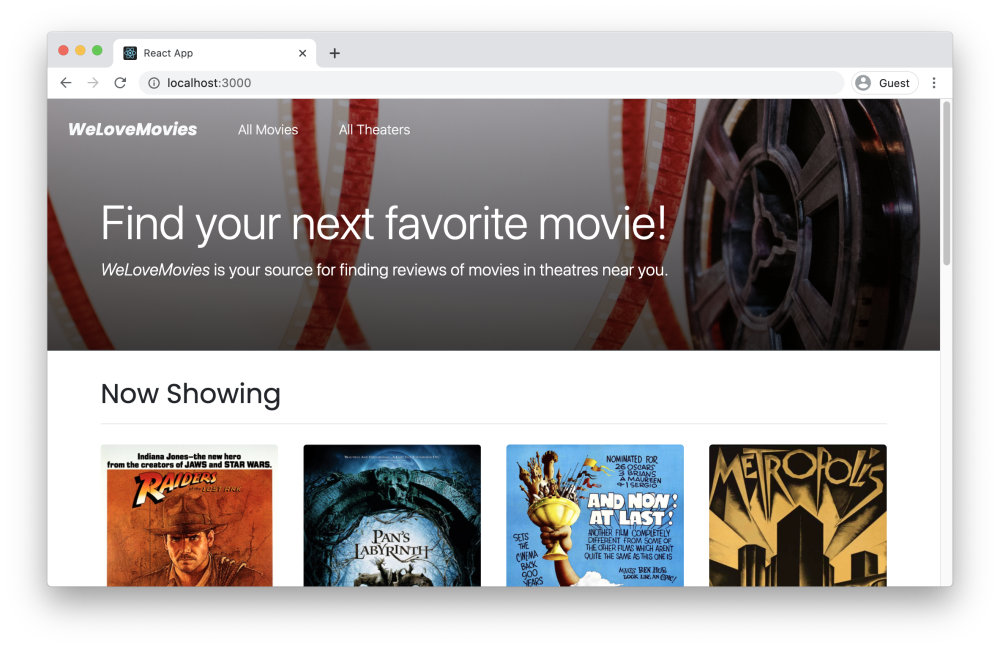

# Capstone: WeLoveMovies - AP | Thinkful
Backend deplyed app on Heroku - https://ap-welovemovies.herokuapp.com/
WeLoveMovies is a Thinkful Backend Development capstone project.
The frontend experience has been given.
I have been tasked with setting up a database and building out specific routes so that users can gain access to data about movies, theaters, and reviews.

# Technologies used
- PostgreSQL
- Node.js
- Express.js
- Knex.js

# Demonstrated the following
- Install and use common middleware packages
- Receive requests through routes
- Running tests from the CI
- Accesss relevant info through route and query params
- Create an error handler, where route does not exist
- Build API following RESTful design principles
- Create and customize knexfile.js file
- Creae a connection to database with Knex
- Write database queries ro complete CRUD routes in an Express server
- Return joined and nested data with Knex
- Write database migrations using Knex's migration tools

# Notes
- HTML and CSS files were given and did not need to be edited
- Frontend application was given and did not need to be edited

# Images
Home Page

